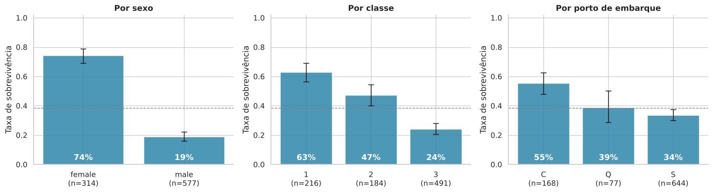
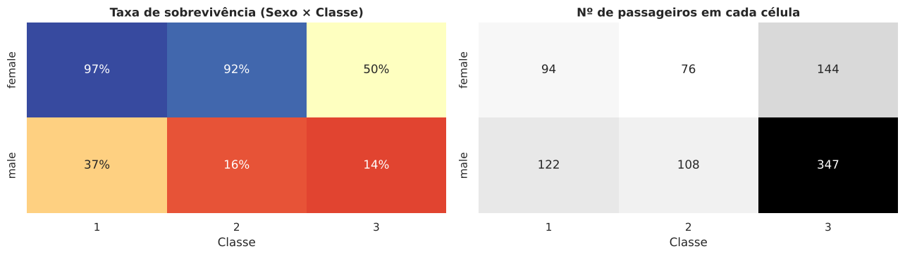
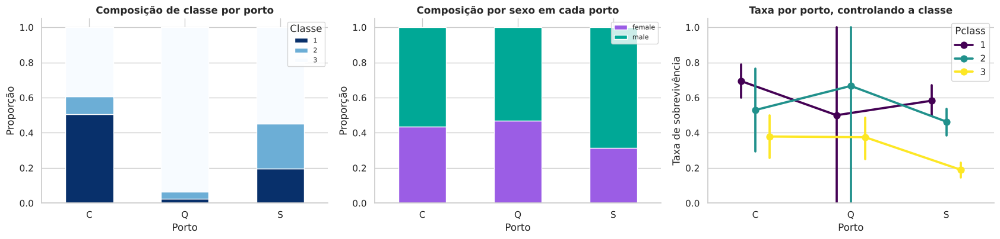
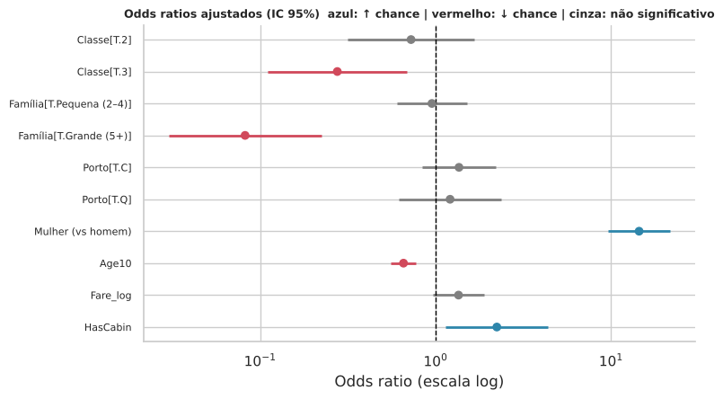
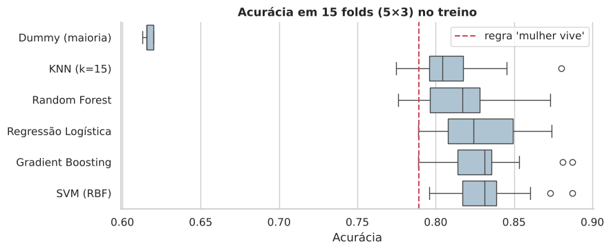
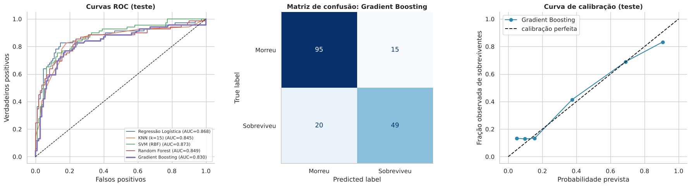
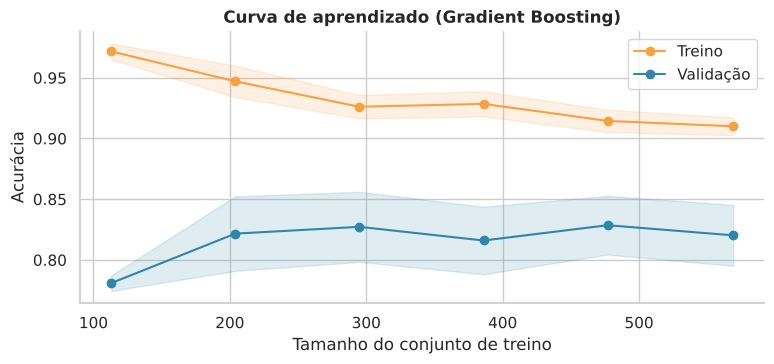
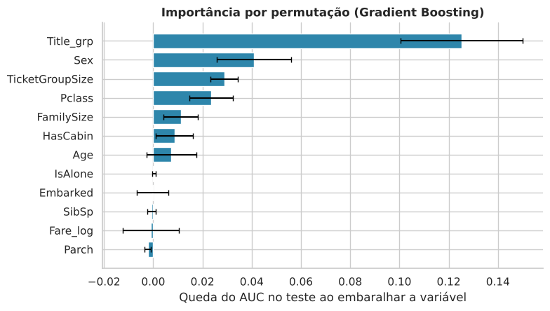

# 1. Introdução

Um estudante que recebe a tarefa "prever quem sobreviveu ao Titanic" costuma abrir o arquivo, aplicar um algoritmo e comemorar uma acurácia de 80%. A pergunta que este artigo coloca é outra: *o que esse número significa e o que ele deixa de dizer?* Para responder, é preciso saber quanto desse resultado já estava disponível em uma regra de uma linha, qual a incerteza associada a uma amostra de 179 passageiros no teste, se o modelo aprendeu algo além do sexo e da classe, e se as comparações entre algoritmos resistem à variação amostral.

O arquivo `train.csv` da competição *Titanic: Machine Learning from Disaster* do Kaggle [@kaggle_titanic] reúne 891 passageiros, uma variável-resposta binária (`Survived`) e onze colunas descritivas. Ele serve como laboratório porque concentra, em pouco espaço, problemas que aparecem em projetos reais: dados ausentes cuja ausência tem estrutura, uma variável de custo muito assimétrica (`Fare`), texto que esconde atributos úteis (`Name`, `Ticket`), uma variável aparentemente explicativa (porto de embarque) que reflete a composição por classe, e efeitos que dependem uns dos outros (sexo e classe).

O percurso a seguir tem oito etapas: descrição do problema (seção 2), estimação com incerteza (3), dados ausentes (4), inferência clássica (5), regressão logística (6), aprendizado de máquina (7), avaliação (8) e interpretação (9). A seção 10 reúne perguntas para discussão. Todo o código está em um notebook Python e em uma página de aula, disponíveis no repositório que acompanha este texto; os números citados saem desse código com semente aleatória fixa (`SEED = 42`).

Este artigo não propõe método novo. Seu objetivo é didático: mostrar, com um caso pequeno, como cada ferramenta se apoia em uma teoria específica e como o conjunto de decisões determina o que se pode afirmar no fim.

# 2. Os dados e o problema

## 2.1 O que a base representa

O arquivo contém 891 passageiros, uma amostra dos cerca de 2.200 ocupantes do navio, e 38,4% deles sobreviveram. Não há documentação do mecanismo de seleção da amostra; qualquer inferência para "todos os passageiros do Titanic" deve ser lida como condicional a essa amostra. A literatura sobre o naufrágio inclui análises sociológicas e econômicas dos mesmos fatores aqui examinados: Hall [-@hall1986] discute o papel da classe social, e Frey, Savage e Torgler [-@frey2011] estudam, em chave econômica, o comportamento sob condições extremas, com atenção a sexo, idade e laços de grupo. Dawson [-@dawson1995] descreve uma versão alternativa dos dados usada no ensino de estatística. Este artigo usa a versão do Kaggle e não reproduz nem contesta esses estudos; sua finalidade é metodológica.

## 2.2 Variáveis

| Variável | Tipo | Observação |
|---|---|---|
| `Survived` | binária | resposta (1 = sobreviveu) |
| `Pclass` | ordinal (1, 2, 3) | proxy de status socioeconômico |
| `Sex`, `Embarked` | categóricas | `Embarked` tem 2 ausentes |
| `Age` | contínua | 177 ausentes (19,9%) |
| `SibSp`, `Parch` | contagens | irmãos/cônjuges, pais/filhos a bordo |
| `Fare` | contínua, assimétrica | assimetria 4,79; 0,39 após `log(1 + x)` |
| `Cabin` | texto | 687 ausentes (77,1%) |
| `Name`, `Ticket` | texto | contêm título e identificação de grupo |

## 2.3 Dois problemas distintos

Há duas perguntas possíveis sobre esses dados. A primeira é *explicativa*: quais características se associam à sobrevivência e com que intensidade? A segunda é *preditiva*: dado um novo passageiro, qual a probabilidade de sobrevivência? Shmueli [-@shmueli2010] mostra que os critérios para construir e avaliar modelos diferem entre as duas. Na pergunta explicativa, interessam coeficientes interpretáveis, controle de confusão e intervalos de confiança; na preditiva, interessa o erro fora da amostra. As seções 3 a 6 tratam da primeira; as seções 7 a 9, da segunda. Os mesmos números servem às duas, mas não respondem às duas da mesma maneira.

# 3. Estimação com incerteza: proporções e intervalos

## 3.1 Intervalo de Wilson

Cada taxa de sobrevivência por grupo é uma proporção $\hat p = k/n$. O intervalo de Wald, $\hat p \pm z\sqrt{\hat p(1-\hat p)/n}$, tem cobertura ruim para $n$ pequeno ou $\hat p$ próximo de 0 ou 1. O intervalo de Wilson [@wilson1927],

$$
\frac{\hat p + \frac{z^2}{2n} \pm z\sqrt{\frac{\hat p(1-\hat p)}{n} + \frac{z^2}{4n^2}}}{1 + \frac{z^2}{n}},
$$

mantém cobertura próxima da nominal nesses casos. No notebook, todo gráfico de barras de taxas traz esse intervalo e o tamanho do grupo ($n$).

## 3.2 Padrões bivariados

A Figura 1 mostra as taxas por sexo, classe e porto. Entre as mulheres, 233 de 314 sobreviveram (74,2%; IC 95% 69,1% a 78,7%); entre os homens, 109 de 577 (18,9%; 15,9% a 22,3%). Por classe, as taxas foram 63,0% (1ª), 47,3% (2ª) e 24,2% (3ª). Por porto, 55,4% em Cherbourg, 39,0% em Queenstown e 33,7% em Southampton.

O cruzamento sexo × classe (Figura 2) revela o que as marginais ocultam: 96,8% das mulheres de 1ª classe e 92,1% das de 2ª sobreviveram, contra 50,0% das de 3ª; entre os homens, 36,9% (1ª), 15,7% (2ª) e 13,5% (3ª).

## 3.3 Confusão e o paradoxo de Simpson

Uma associação bruta pode mudar de tamanho, ou até de sinal, quando se condiciona a uma terceira variável; o caso-limite é o paradoxo de Simpson [@simpson1951]. O porto de embarque ilustra uma versão atenuada. Em Cherbourg, 50,6% dos passageiros eram de 1ª classe (85 de 168); em Southampton, 19,7% (127 de 644); em Queenstown, 93,5% eram de 3ª classe (72 de 77). Como a classe se associa fortemente à sobrevivência, o porto herda parte do efeito. A Figura 3 separa o porto por classe: a vantagem de Cherbourg diminui, mas não desaparece (1ª classe: 69% contra 58% em Southampton; 3ª classe: 38% contra 19%). Os grupos de Queenstown em 1ª e 2ª classe têm 2 e 3 pessoas, e os intervalos correspondentes cobrem quase todo o intervalo $[0,1]$.

A seção 6 quantifica a parte do efeito que sobrevive ao ajuste.

# 4. Dados ausentes

## 4.1 Mecanismos

Rubin [-@rubin1976] distingue três mecanismos. Os dados ausentes são MCAR (*missing completely at random*) quando a ausência independe de qualquer valor, observado ou não; MAR (*missing at random*) quando depende apenas de valores observados; MNAR (*missing not at random*) quando depende do próprio valor ausente. A distinção importa porque métodos simples, como descartar linhas incompletas, só são válidos sob MCAR, e as demais situações exigem modelar o processo de ausência ou imputar com cuidado [@little2019].

## 4.2 Evidência nos dados

A cabine foi registrada para 81,5% dos passageiros de 1ª classe, 8,7% dos de 2ª e 2,4% dos de 3ª; entre os com cabine registrada, 66,7% sobreviveram, contra 30,0% dos sem registro. As idades ausentes concentram-se na 3ª classe (27,7% de ausência, contra 13,9% na 1ª e 6,0% na 2ª), e os sem idade sobreviveram menos (29,4% contra 40,6%). Esses números descartam MCAR para as duas variáveis. Com os dados disponíveis não é possível distinguir MAR de MNAR; o padrão é compatível com MAR condicional à classe, mas essa é uma suposição.

## 4.3 Imputação e seus efeitos

Para a idade, o notebook usa a mediana por título × classe. O título extraído do nome (Master, Miss, Mr, Mrs) separa meninos e adultos; a mediana de idade de um "Master" é de 4 anos na 1ª e 3ª classes, e a de um "Mr" varia de 26 (3ª) a 40 anos (1ª). Dois cuidados acompanham a imputação.

O primeiro é que a imputação simples reduz a variância: o desvio-padrão da idade cai de 14,53 (714 valores conhecidos) para 13,49 após preencher os 891, e a média passa de 29,70 para 29,14. Em modelos para inferência, esse encolhimento torna os intervalos de confiança mais estreitos do que deveriam; a imputação múltipla [@little2019] incorpora a incerteza do preenchimento e é a alternativa quando a ausência não é desprezível. O segundo cuidado é o indicador `Age_ausente`, que preserva a informação de que o valor foi imputado, já que a ausência em si tem associação com o desfecho.

# 5. Inferência clássica

## 5.1 Associação entre categóricas

Para uma tabela de contingência $r \times c$ com $n$ observações, a estatística de qui-quadrado de Pearson compara contagens observadas e esperadas sob independência. Com $n$ moderado, quase toda associação é "significativa"; por isso se reporta também o V de Cramér [@cramer1946],

$$
V = \sqrt{\frac{\chi^2}{n\,\min(r-1,\,c-1)}},
$$

que varia de 0 a 1. Os valores obtidos, em ordem decrescente, foram: título 0,57; sexo 0,54; classe 0,34; convés 0,33; cabine registrada 0,32; categoria de família 0,29; viajar só 0,20; porto 0,17 (todos com $p < 10^{-5}$). O V do convés é inflado pela categoria "desconhecido", quase equivalente a "sem cabine". Título e sexo são quase redundantes: o título é, em grande parte, o sexo com informação adicional sobre idade e estado civil.

Um erro frequente é aplicar teste $t$ ou ANOVA à variável binária. Com amostras grandes isso aproxima o resultado do teste de duas proporções, mas viola a suposição de normalidade do desfecho e não oferece medida de efeito natural para dados binários. O teste qui-quadrado (ou o teste exato de Fisher, para tabelas 2×2) é o instrumento adequado [@agresti2013].

## 5.2 Razão de chances e risco relativo

Na tabela 2×2 sexo × desfecho, a razão de chances é $\widehat{OR} = ad/(bc)$, com $a$ e $b$ as mulheres que sobreviveram e morreram e $c$ e $d$ os homens que sobreviveram e morreram, e o erro-padrão de seu logaritmo é $\sqrt{1/a + 1/b + 1/c + 1/d}$ [@agresti2013]. Os dados dão $\widehat{OR} = 12{,}4$ (IC 95% 8,9 a 17,1), risco relativo de 3,93 e diferença absoluta de 55,3 pontos percentuais (Fisher exato, $p = 6{,}5 \times 10^{-60}$). A razão de chances de 12,4 e o risco relativo de 3,93 descrevem o mesmo contraste em escalas diferentes; a razão de chances só se aproxima do risco relativo quando o desfecho é raro, o que não é o caso aqui (38,4% de sobreviventes).

## 5.3 Variáveis contínuas e probabilidade de superioridade

Para idade e tarifa, que são assimétricas, usa-se o teste de Mann-Whitney [@mann1947]. A estatística $U$ dividida por $n_1 n_0$ estima $P(X_1 > X_0)$, a probabilidade de que um sobrevivente sorteado tenha valor maior que um não sobrevivente sorteado (0,5 = nenhuma diferença). Os resultados foram: tarifa, 0,692 ($p = 4{,}6 \times 10^{-22}$); tarifa por pessoa, 0,687; tamanho da família, 0,586; idade, 0,469 ($p = 0{,}16$). A idade isolada não separa os grupos porque seu efeito tem sinais opostos conforme o sexo e é grande apenas nas crianças pequenas (0 a 4 anos: 67,5% de sobrevivência, contra 35,1% na faixa de 18 a 29).

## 5.4 Dependência dentro de grupos

Passageiros com o mesmo bilhete tendem a ter o mesmo desfecho. Um teste de permutação confirma: em 134 grupos de bilhete com pelo menos duas pessoas, a fração de pares com desfecho igual foi 0,761, contra 0,525 esperado quando os desfechos são embaralhados (2.000 permutações; $p < 0{,}001$). Esse resultado não identifica um mecanismo, pois pessoas que viajam juntas também compartilham sexo, classe e idade aproximada. Ele indica, de todo modo, que as observações não são independentes, o que afeta a leitura de erros-padrão e justifica o atributo `TicketGroupSize` nos modelos preditivos.

# 6. Regressão logística

## 6.1 Modelo e estimação

Seja $Y_i \in \{0,1\}$ a sobrevivência e $x_i$ o vetor de covariáveis. A regressão logística é o modelo linear generalizado com ligação logit:

$$
\log\frac{P(Y_i = 1 \mid x_i)}{1 - P(Y_i = 1 \mid x_i)} = \beta_0 + x_i^\top \beta.
$$

Os coeficientes são estimados por máxima verossimilhança, maximizando $\ell(\beta) = \sum_i \big[y_i \log p_i + (1-y_i)\log(1-p_i)\big]$. O exponencial de $\beta_j$ é a razão de chances associada ao aumento de uma unidade em $x_j$, mantidas as demais covariáveis fixas [@hosmer2013]. Razões de chances ajustadas e brutas estimam quantidades diferentes: a razão de chances não é "colapsável", isto é, pode mudar ao se incluir covariáveis mesmo sem confusão [@greenland1999]. Por isso, diferenças entre o valor bruto e o ajustado não devem ser lidas apenas como medida de confusão.

## 6.2 Efeitos ajustados

O modelo completo (n = 889, pseudo-R² de McFadden = 0,364) inclui sexo, classe, idade (por década), categoria de família, log da tarifa, cabine registrada e porto. A Figura 4 mostra as razões de chances. Ser mulher tem razão de chances 14,5 (IC 95% 9,6 a 21,7). A 3ª classe, contra a 1ª, tem 0,28 (0,11 a 0,69; $p = 0{,}006$); a 2ª classe não se distingue da 1ª (0,72; 0,32 a 1,67). Cada década adicional de idade reduz as chances em 34% (razão 0,66; 0,56 a 0,78). Famílias de 5 ou mais pessoas têm razão 0,08 (0,03 a 0,22) em relação a quem viaja só, e ter cabine registrada dobra as chances (2,23; 1,14 a 4,39). A razão para famílias de 2 a 4 pessoas (0,95; 0,60 a 1,50) não se distingue de 1, embora a taxa bruta desse grupo (57,9%) seja quase o dobro da de quem viaja só (30,4%): a vantagem bruta é explicada por sexo, classe e cabine.

## 6.3 Razão de verossimilhança, AIC e interação

Para comparar modelos aninhados, a estatística da razão de verossimilhança, $2(\ell_1 - \ell_0)$, segue aproximadamente uma $\chi^2$ com graus de liberdade iguais ao número de parâmetros adicionais, sob a hipótese nula e condições de regularidade [@hosmer2013]. O AIC penaliza a log-verossimilhança pelo número de parâmetros e serve para comparar modelos não necessariamente aninhados.

*Porto.* A razão de chances de Cherbourg contra Southampton é 2,44 (IC 95% 1,73 a 3,45) sozinha; 1,81 (1,16 a 2,84) controlando classe e sexo (razão de verossimilhança para o bloco do porto: $\chi^2(2) = 7{,}96$; $p = 0{,}019$); e 1,36 (0,84 a 2,21; $p = 0{,}21$) no modelo completo. A hipótese de ausência total de efeito do porto não é rejeitada no modelo completo, mas o intervalo é largo e inclui razões de chances de até 2,2. A conclusão que os dados sustentam é que a maior parte da vantagem bruta de Cherbourg decorre de composição (classe, cabine), podendo restar um efeito pequeno que 889 observações não permitem estimar com precisão.

*Interação.* Adicionar o produto sexo × classe a um modelo aditivo (sexo, classe, idade) reduz o AIC de 810,1 para 781,4 ($\chi^2(2) = 32{,}7$; $p = 7{,}9 \times 10^{-8}$). A interação sexo × idade, adicionada em seguida, tem $\chi^2(1) = 3{,}50$ ($p = 0{,}061$), evidência fraca. Pelo modelo com interações, uma pessoa de 30 anos tem probabilidade prevista de sobrevivência de 97,2% (mulher, 1ª), 92,1% (mulher, 2ª), 45,3% (mulher, 3ª), 50,0% (homem, 1ª), 14,0% (homem, 2ª) e 10,2% (homem, 3ª). Uma mulher de 3ª classe tem, portanto, probabilidade comparável à de um homem de 1ª classe.

## 6.4 Multicolinearidade

O fator de inflação da variância (VIF) do coeficiente $j$ é $1/(1 - R_j^2)$, com $R_j^2$ obtido regredindo $x_j$ nas demais covariáveis. No conjunto do modelo logístico, os VIF ficaram entre 1,10 (sexo) e 3,37 (classe), valores sem consequência prática. Incluir juntos `SibSp`, `Parch` e `FamilySize = SibSp + Parch + 1` produz colinearidade exata (VIF infinito) e torna os coeficientes individuais indeterminados.

# 7. Aprendizado de máquina

## 7.1 Risco, generalização e validação

O objetivo preditivo é minimizar o erro esperado em dados novos, não o erro nos dados de treino. Sob perda quadrática, o erro esperado de predição de um ponto decompõe-se em viés ao quadrado, variância e ruído irredutível [@hastie2009]. Modelos flexíveis reduzem o viés e aumentam a variância; modelos rígidos fazem o oposto. Como o erro de treino subestima o erro de generalização, estima-se este último em dados não usados no ajuste: um conjunto de teste, reservado e tocado uma única vez, e a validação cruzada [@stone1974] dentro do treino. No estudo, 20% dos dados (179 passageiros) formam o teste, estratificado pelo desfecho, e a comparação entre modelos usa validação cruzada de 5 partições repetida 3 vezes sobre os 712 passageiros restantes.

## 7.2 Vazamento de dados

Há vazamento quando informação do conjunto de avaliação influencia o ajuste [@kaufman2012]. Um exemplo comum: calcular a mediana de idade por título usando todos os 891 passageiros antes de separar o teste. O notebook evita isso colocando a imputação, a padronização e a codificação *one-hot* dentro de um `Pipeline` do scikit-learn [@pedregosa2011], de modo que cada partição da validação cruzada reajusta essas etapas apenas com seus dados de treino. Uma exceção declarada: `TicketGroupSize` é contado sobre os 891 registros. A contagem não usa o desfecho, mas depende de o conjunto conter os demais ocupantes de cada bilhete.

## 7.3 Os modelos comparados

*Regressão logística* com penalização $\ell_2$: minimiza $\tfrac12\lVert w\rVert^2 + C\sum_i \text{perda-log}_i$, de modo que $C$ pequeno regulariza mais. *K vizinhos mais próximos* (KNN) classifica pela maioria entre os $k$ pontos mais próximos no espaço padronizado; $k$ pequeno dá variância alta. *Máquina de vetores de suporte* (SVM) com núcleo gaussiano $k(x,x') = \exp(-\gamma\lVert x-x'\rVert^2)$ busca a fronteira de margem máxima com folgas penalizadas por $C$ [@cortes1995]. *Floresta aleatória* média árvores treinadas em amostras *bootstrap* e com sorteio de atributos a cada divisão, o que reduz a correlação entre árvores e, com isso, a variância da média [@breiman2001]. *Gradient boosting* ajusta árvores rasas em sequência, cada uma aos resíduos da anterior, com encolhimento (taxa de aprendizado) [@friedman2001].

Os hiperparâmetros foram escolhidos por busca em grade com validação cruzada de 5 partições, usando o AUC como critério. A pontuação do melhor ponto da grade é otimista, pois o mesmo dado serve à seleção e à estimativa; por isso a avaliação final usa o teste.

## 7.4 Resultados em validação cruzada

Antes do ajuste fino (média de 15 partições): regressão logística, acurácia 0,827 (desvio-padrão entre partições 0,026), AUC 0,871; KNN, 0,811 e 0,865; SVM, 0,832 e 0,865; floresta, 0,817 e 0,874; boosting, 0,830 e 0,893. Um classificador que prevê sempre "morreu" obtém 0,617. A regra "mulher sobrevive, homem morre" acerta 78,7% do arquivo completo.

Com desvio-padrão de cerca de 2,5 pontos percentuais entre partições, as diferenças de acurácia entre os cinco modelos (no máximo 2,1 pontos) estão dentro da variação amostral. O boosting se destaca apenas no AUC (0,893), e mesmo essa diferença deve ser lida com cautela, pois as 15 partições compartilham dados e não são independentes.

# 8. Avaliação

## 8.1 Métricas

A matriz de confusão resume acertos e erros por classe. A acurácia depende da prevalência (aqui 38,4%), de modo que se compara sempre com a linha de base. Precisão e *recall* da classe positiva são $VP/(VP+FP)$ e $VP/(VP+FN)$, e o $F_1$ é sua média harmônica. A curva ROC varre o limiar de decisão e plota a taxa de verdadeiros positivos contra a de falsos positivos; a área sob ela (AUC) é igual à probabilidade de que um positivo sorteado receba escore maior que um negativo sorteado, ou seja, é a mesma quantidade $U/(n_1 n_0)$ da seção 5.3 aplicada ao escore do modelo [@hanley1982]. O escore de Brier, $\frac1n\sum(\hat p_i - y_i)^2$ [@brier1950], mede a qualidade das probabilidades; a curva de calibração compara probabilidade prevista e frequência observada [@niculescu2005].

## 8.2 Resultado no teste

A Tabela 1 resume o teste (n = 179, 69 sobreviventes). O intervalo de Wilson para a acurácia tem amplitude de cerca de 12 pontos percentuais; um acerto a mais ou a menos altera a acurácia em 0,56 ponto.

| Modelo (ajustado) | Acurácia (IC 95%) | AUC | Brier |
|---|---|---|---|
| Sempre "morreu" | 0,615 (0,542 a 0,683) | 0,500 | 0,385 |
| Regra "mulher vive" | 0,777 (0,710 a 0,831) | 0,753 | 0,223 |
| Regressão logística | 0,844 (0,783 a 0,890) | 0,868 | 0,130 |
| KNN | 0,793 (0,728 a 0,846) | 0,845 | 0,147 |
| SVM (RBF) | 0,816 (0,752 a 0,866) | 0,873 | 0,136 |
| Floresta aleatória | 0,810 (0,746 a 0,861) | 0,849 | 0,139 |
| Gradient boosting | 0,804 (0,740 a 0,856) | 0,830 | 0,152 |

: Desempenho no conjunto de teste.

O modelo escolhido pela validação cruzada (gradient boosting, por ter o maior AUC no treino: 0,900 na grade) obteve 80,4% no teste, e a regressão logística, 84,4%. Os dois resultados são compatíveis com um mesmo desempenho verdadeiro dado o intervalo de ±6 pontos percentuais, e na validação cruzada, que usa quatro vezes mais dados, os dois ficaram empatados (83,0% e 82,7%). A escolha do modelo não foi refeita após ver o teste; refazê-la seria uma forma de vazamento.

## 8.3 O modelo supera a regra de uma linha?

O teste de McNemar compara dois classificadores avaliados nos mesmos casos, usando apenas os pares discordantes [@mcnemar1947]. Sob a hipótese nula, o número de casos em que apenas o modelo acerta segue uma binomial com $p = 0{,}5$ entre os discordantes. O gradient boosting acertou 16 casos em que a regra errou e errou 11 em que a regra acertou (teste exato, $p = 0{,}44$). Com 179 passageiros o teste tem pouco poder; a ausência de significância não prova equivalência, mas indica que este teste não permite afirmar superioridade.

## 8.4 Limiar de decisão e curva de aprendizado

O limiar 0,5 é uma convenção. Usando previsões obtidas por validação cruzada no treino, o limiar que maximiza acurácia e $F_1$ foi 0,37; no teste, a acurácia com 0,37 foi 0,799, contra 0,804 com 0,5. A escolha do limiar deve refletir os custos relativos de falso positivo e falso negativo, que a estatística sozinha não fixa.

A curva de aprendizado (Figura 7) mostra a acurácia de validação estabilizando em torno de 0,82 a partir de cerca de 300 passageiros, enquanto a de treino cai de 0,97 para 0,91. Essa lacuna de cerca de 9 pontos percentuais indica sobreajuste e sugere que mais dados do mesmo tipo trariam ganho pequeno.

# 9. Interpretação do modelo

## 9.1 Importância por permutação

A importância por permutação mede a queda de uma métrica no teste quando os valores de uma variável são embaralhados, rompendo sua relação com a resposta [@breiman2001]. Com o AUC como métrica, a queda foi 0,125 para o título, 0,041 para o sexo, 0,029 para o tamanho do grupo de bilhete e 0,024 para a classe; tarifa, porto, `SibSp` e `Parch` ficaram em torno de zero (entre −0,002 e 0,000). O método tem uma limitação conhecida: com variáveis correlacionadas (título e sexo), o embaralhamento de uma delas deixa a outra carregando a informação, e a importância de cada uma fica subestimada isoladamente.

## 9.2 Análise dos erros

No teste, o modelo errou 43,3% dos homens de 1ª classe (13 de 30) e 28,6% das mulheres de 3ª classe (8 de 28), os dois grupos cujos desfechos se aproximam de uma moeda justa nos dados. Entre os erros de maior confiança estão uma menina de 2 anos da 1ª classe que morreu (probabilidade prevista de sobrevivência: 97%) e cinco homens que sobreviveram, previstos com probabilidade de 2% a 9%. A informação que distinguiria esses casos (posição no navio, acesso a um bote, decisões individuais) não está no arquivo, e é razoável supor que parte substancial do erro seja irredutível com estas variáveis.

# 10. Discussão e perguntas para seminário

**O que os resultados sustentam.** Nesta amostra de 891 passageiros, sexo e classe explicam a maior parte da variação previsível na sobrevivência; o efeito do sexo depende da classe; porto e tarifa perdem relevância depois do ajuste; e modelos de aprendizado de máquina com vários atributos engenhados não se distinguem de modo confiável de uma regra de uma linha em um teste de 179 casos. Em validação cruzada, a vantagem sobre a regra é de 2 a 5 pontos percentuais.

**O que não sustentam.** Os coeficientes descrevem associações em dados observacionais. Que o porto não tenha efeito ajustado não implica que a localização de embarque fosse irrelevante para a evacuação; que a tarifa não tenha efeito próprio não implica que a riqueza fosse irrelevante, pois a classe e a cabine podem ser mediadores dela. Cada afirmação causal exigiria um modelo causal explícito e suposições de identificação que os dados, sozinhos, não fornecem.

Perguntas para discussão:

1. A imputação por título × classe deixa o desvio-padrão da idade menor que o observado. Em que tipo de análise essa redução é grave e em que tipo é inócua? Como a imputação múltipla mudaria os intervalos da seção 6?
2. A razão de chances do sexo é 12,4 (bruta) e 14,5 (ajustada). Que mecanismos podem explicar o aumento depois do ajuste (confusão por classe, não colapsabilidade da razão de chances)? Como separá-los empiricamente?
3. Um aluno propõe reportar 84,4% (regressão logística) em vez de 80,4% (modelo escolhido) por ser "o melhor no teste". Que erro metodológico isso comete e que quantidade deveria ser reportada?
4. Se o teste tivesse 1.790 passageiros em vez de 179, com as mesmas acurácias, o teste de McNemar rejeitaria a hipótese de igualdade com a regra? Calcule o poder aproximado.
5. A importância por permutação atribui ao título a maior queda de AUC. Reformule o modelo sem a variável título e discuta como a importância se redistribui.
6. O arquivo `test.csv` do Kaggle não tem o desfecho. Qual é a estimativa de erro mais honesta para a pontuação do *leaderboard*, e por que o valor publicado pode diferir da validação cruzada?

# 11. Conclusão

Com os 891 passageiros do arquivo de treino, as evidências mostram uma sobrevivência fortemente ligada ao sexo, à classe e à interação entre os dois. O tratamento de dados ausentes, a investigação de confusão e a comparação com linhas de base mudaram as conclusões em cada etapa: o porto de embarque deixou de ser relevante depois de controlar a composição de classe; modelos que parecem diferir em 4 pontos de acurácia em um teste pequeno ficaram empatados na validação cruzada; e uma regra de uma linha ficou a 2 a 5 pontos dos melhores classificadores. Essas conclusões valem para esta amostra, estes atributos e esta partição aleatória; que se estendam a outros desastres ou a outros conjuntos de dados é uma hipótese que este estudo não testa.

# Reprodutibilidade

O notebook `Titanic_Analise_Completa.ipynb` e a página de aula reproduzem todos os números deste artigo com `SEED = 42`. Bibliotecas: pandas, NumPy, SciPy, statsmodels, scikit-learn, matplotlib e seaborn. Pequenas diferenças podem surgir entre versões. O repositório contém instruções de instalação e de citação.

# Referências {-}

::: {#refs}
:::
